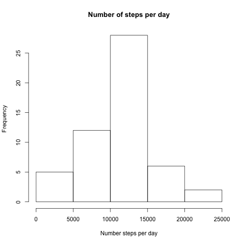
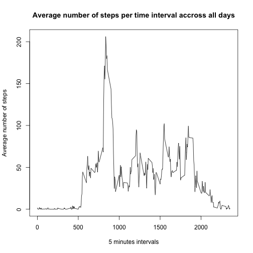
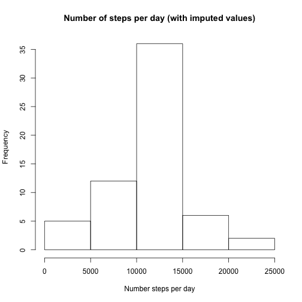

# Reproducible Research: Peer Assessment 1
## Loading and preprocessing the data
Show any code that is needed to

- Load the data (i.e. 𝚛𝚎𝚊𝚍.𝚌𝚜𝚟())
- Process/transform the data (if necessary) into a format suitable for your analysis

    
    ```r
    invisible(Sys.setlocale("LC_ALL",locale="en_US.utf8"))
    unzip("activity.zip")
    df <- read.csv("activity.csv", header=TRUE, sep=",")
    df$date <- as.Date(df$date,"%Y-%m-%d")
    ```

## What is mean total number of steps taken per day?
For this part of the assignment, you can ignore the missing values in the dataset.

1. Make a histogram of the total number of steps taken each day

    
    ```r
    dfAggrSum <- aggregate(steps~date, data=df, FUN=sum)
    hist(dfAggrSum$steps,main="Number of steps per day",xlab="Number steps per day")
    ```
    
    

2. Calculate and report the **mean** and **median** total number of steps taken per day

    
    ```r
    m <- mean(dfAggrSum$steps)
    med <- median(dfAggrSum$steps)
    ```

The **mean** of the  average total number of steps taken per day is: 10766.19

The **median** of the  average total number of steps taken per day is:  10765


## What is the average daily activity pattern?

1. Make a time series plot (i.e. type = "l") of the 5-minute interval (x-axis) and the average number of steps taken, averaged across all days (y-axis)

    
    ```r
    dfAggrIMean <- aggregate(steps ~ interval, data=df, FUN=mean)
    plot(dfAggrIMean, type="l", xlab="5 minutes intervals", ylab="Average number of steps", 
         main="Average number of steps per time interval accross all days")
    ```
    
    

2. Which 5-minute interval, on average across all the days in the dataset, contains the maximum number of steps?

    
    ```r
    intervalNb <- dfAggrIMean$interval[which.max(dfAggrIMean$steps)]
    stepsNb <- dfAggrIMean$steps[which.max(dfAggrIMean$steps)]
    ```

    Interval 835 contains the maximum number of steps, which is: 206 steps.

## Imputing missing values
1. Calculate and report the total number of missing values in the dataset (i.e. the total number of rows with NAs)

    
    ```r
    totalMissing <- length(which(is.na(df$steps)))
    totalValues <-  length(df$steps)
    ```

    There are 2304 missing values, which represent 13% of the total values.

2. Devise a strategy for filling in all of the missing values in the dataset. The strategy does not need to be sophisticated. For example, you could use the mean/median for that day, or the mean for that 5-minute interval, etc.

    ```
    For this assignment the mean strategy has been chosen.

    That is for each missing value in a interval, the mean of this interval is chosen.
    ```

3. Create a new dataset that is equal to the original dataset but with the missing data filled in.

    
    ```r
    dfAggrIMean <- aggregate(steps ~ interval, data=df, FUN=mean)
    dfNoNA <- df
    for (i in seq_along(df$steps)) {
        if (is.na(df$steps[i])) {
            dfNoNA$steps[i] <- dfAggrIMean$steps[which(dfAggrIMean$interval==df$interval[i])]
        }
    }
    ```

4. Make a histogram of the total number of steps taken each day and Calculate and report the mean and median total number of steps taken per day. Do these values differ from the estimates from the first part of the assignment? What is the impact of imputing missing data on the estimates of the total daily number of steps?

    
    ```r
    dfNoNAAggrSum <- aggregate(steps~date, data=dfNoNA, FUN=sum)
    hist(dfNoNAAggrSum$steps,main="Number of steps per day (with inputed values)",xlab="Number steps per day")
    ```
    
    

    
    ```r
    mI <- mean(dfNoNAAggrSum$steps)
    medI <- median(dfNoNAAggrSum$steps)
    ```

The **mean** of the  average total number of steps taken per day for the imputed dataset is: 10766.19

The **median** of the  average total number of steps taken per day for the imputed dataset is:  10766.19

Before imputing, the median was one unit lower, now both mean and median are the same.

## Are there differences in activity patterns between weekdays and weekends?
1. Create a new factor variable in the dataset with two levels -- "weekday" and "weekend" indicating whether a given date is a weekday or weekend day.

    
    ```r
    df$week <- as.factor(weekdays(df$date) %in% c("Saturday","Sunday"))
    levels(df$week)[levels(df$week)==T] <- "weekend"
    levels(df$week)[levels(df$week)==F] <- "weekday"
    dfAggregated <- aggregate(steps ~ week+interval,data=df, FUN=mean)
    ```

2. Make a panel plot containing a time series plot (i.e. type = "l") of the 5-minute interval (x-axis) and the average number of steps taken, averaged across all weekday days or weekend days (y-axis).

    
    ```r
    library(ggplot2)
    ggplot(dfAggregated, aes(interval,steps)) +
        geom_line(aes(colour=week)) +
        facet_wrap(~week, ncol=1) +
        theme_bw() + 
        theme(strip.text.x = element_text(size = 15))
    ```
    
    

It seems that on average, people walk more and more regulary accross the day during weekends.

